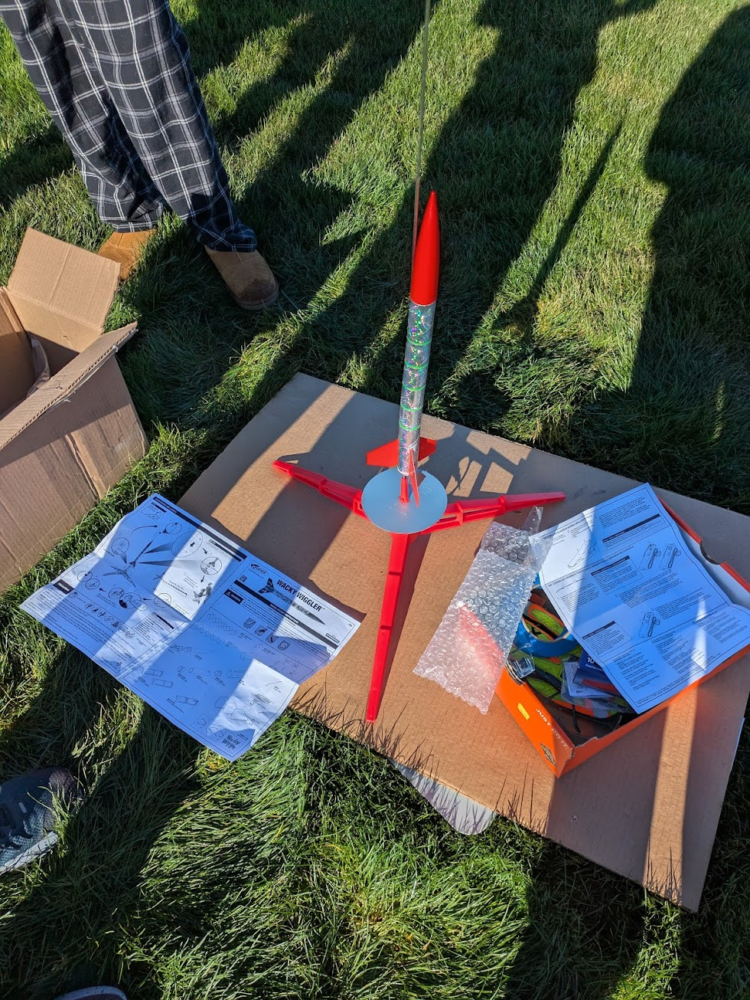

# Estes Wacky Wiggler — First Launch

**Date:** January 18, 2026 · **Location:** Sixty Acres Park, Redmond, WA

My first model rocket launch. Goal was simple: get a rocket in the air and recover it safely — while running a motor comparison experiment between a B6-4 and C6-5 engine.

---

## Specifications

| Spec | Value |
|------|-------|
| Model | Estes Wacky Wiggler |
| Motors tested | B6-4, C6-5 |
| Height | 17.6 in |
| Weight (est.) | ~2.3 oz |
| Predicted altitude | 800–1000 ft |
| Measured altitude | B6-4: ~700 ft · C6-5: ~1100 ft (visual estimate) |
| Recovery system | Wiggle (no parachute) |

---

## Launch Day

**Weather:** Sunny, 4 mph winds

### Pre-Launch Checklist
- [x] Motor installed correctly
- [x] Recovery wadding in place
- [x] Wiggler packed properly
- [x] Launch rod angle checked
- [x] Igniter secured

### Flight Log

| Attempt | Motor | Result | Est. Altitude | Notes |
|---------|-------|--------|---------------|-------|
| 1 | — | Scratch | — | Forgot igniter |
| 2 | B6-4 | Success | ~700 ft | Straight flight |
| 3 | C6-5 | Success | ~1100 ft | ~50% higher, good wiggle |

<video src="media/launch-video.mp4" controls width="100%"></video>
---

## Results

Both launches were successful. The C6-5 reached roughly **50% greater altitude** than the B6-4, confirming the motor comparison hypothesis. The wiggle recovery worked well in the open grass field — faster descent than a parachute — though at higher altitudes a parachute would be needed for easier tracking.

Drone footage of liftoff came out well, though a wider angle from further away would better capture the full flight arc.

---

## Build Notes

- Applied too much glue to engine mount; had to scrape it off
- Forgot igniters and masking tape on first launch attempt — had to reschedule (weather had turned bad by then)

---

## Lessons Learned

- **Motor power matters:** C6-5 reached ~50% more altitude than B6-4 — a real, observable difference
- **Wiggle recovery is fast** in open fields, but a parachute becomes necessary at higher altitudes for tracking
- **Pre-launch prep is critical:** a forgotten igniter cost an entire launch day; will triple-check everything and bring spares going forward

---

## Improvements for Next Time

- [ ] Set up a parachute recovery system
- [ ] Add a simple altimeter payload (or use a phone app for height measurement)
- [ ] Simulate flight in [OpenRocket](https://openrocket.info/) before launch to close the prediction-measurement loop
- [ ] Use a stricter pre-launch checklist and bring backup supplies
- [ ] Record from further away with the drone to capture more of the flight arc
- [ ] Make design customizations for increased altitude

---

## Reflection

I started rocketry to apply my background in robotics and CAD to aerospace testing. This launch proved I could execute a safe launch and design a simple experiment (motor comparison). 

Next steps: add OpenRocket simulations and altimeter data to get actual altitude numbers, and build toward more complex experiments with custom 3D-printed components.

---

## Next Steps

1. Build a more advanced kit with parachute + altimeter
2. Use OpenRocket to simulate before each flight
3. Build a custom model rocket with 3D-printed parts

---

*Part of my journey into model rocketry and aerospace engineering.*
